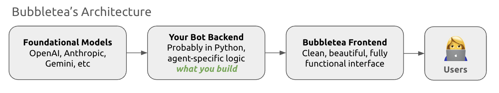

# Bubbletea: Your Chatbot's Frontend

## What is Bubbletea?
Bubbletea is the fastest way to get your chatbot in front of users.

If you’ve already built a chatbot backend — using OpenAI, LangChain, or your own custom logic — Bubbletea gives you a hosted chat interface in seconds. Just provide your bot’s name and API endpoint, and Bubbletea generates a clean, mobile-friendly chat page you can share instantly.

Think of it like Webflow for chatbots — no frontend code, no deployment, no hassle.

## Why use Bubbletea?
🛠 No front-end needed – Build your bot in Python (or any language), plug it in, and you’re live.

⚡️ Instantly shareable – Each bot gets its own unique URL.

💬 Flexible output – Supports plain text, markdown, images, and more.

🧑‍💻 Developer-friendly – Simple API spec, works with any backend, integrates with your tools.

🧼 Clean UX – Polished UI optimized for both desktop and mobile.

## Who is it for?
AI engineers and indie hackers prototyping new agents

Startups demoing internal tools

Agencies building custom bots for clients

Anyone who doesn’t want to build a front end for every bot

## Architecture



Your bot connects to a foundational model, and probably contains some unique agentic functionality. It then connects to Bubbletea's API, which in turn, connects to a frontend.

## Getting started

We'll explore getting started by building the simplest bot - an echobot that simply echos the user's input - in three steps.

### Step 1: Create and deploy your endpoint

Create a Python file with the following code - 

```
code
```

We'll use Replit here, but 

### Step 2: Register your bot on Bubbletea

content

### Step 3: Test your bot

content

## Learn more

Now that you've built your first Bubbletea bot, let's explore what else you can do.
